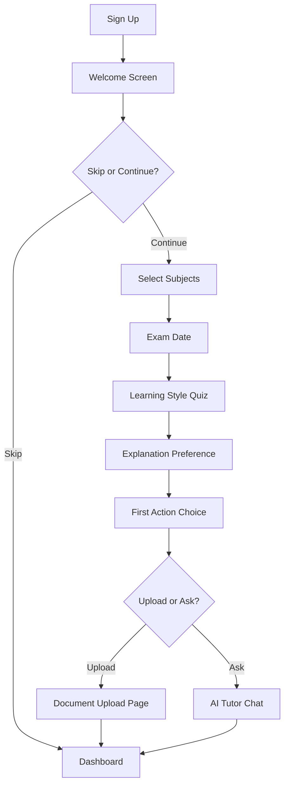

# Progressive Onboarding System

## Overview
The Progressive Onboarding System provides a streamlined, friction-free signup and onboarding experience that collects user information gradually over time rather than all at once.

## Key Features

### 1. Simplified Signup
- **Minimal Fields**: Only name, email, and password required
- **Social Auth Ready**: Infrastructure for Google/Apple sign-in (to be configured)
- **No Demographic Data**: Academic level, subjects, and other details collected later
- **Quick Start**: Users can complete signup in under 30 seconds

### 2. Interactive Onboarding Flow

#### Step 1: Welcome
- Introduction to the platform
- Overview of what to expect
- Option to skip and explore independently

#### Step 2: Subject Selection
- Autocomplete search for subjects
- Quick-add popular subjects
- Add custom subjects
- Skip option available

#### Step 3: Exam Date (Optional)
- Calendar picker for upcoming exams
- Helps with study schedule planning
- Clearly marked as optional
- Skip-friendly design

#### Step 4: Learning Style Assessment
- 3 quick questions
- Determines: Visual, Auditory, Kinesthetic, or Reading preference
- Takes under 1 minute
- Results used to personalize content delivery

#### Step 5: Explanation Preference
- Choose between:
  - **Visual**: Diagrams and charts
  - **Technical**: Detailed, precise terminology
  - **Simple**: Easy-to-understand, no jargon
- Affects AI tutor response style

#### Step 6: First Action
- Two clear paths to value:
  1. **Upload Document**: Get summaries, flashcards, study guides
  2. **Ask Question**: Chat with AI tutor
- Guarantees value within 3 minutes

### 3. Progressive Profiling

The system tracks user sessions and progressively requests additional information:

- **Session 3**: Learning goals prompt
- **After 1 Week**: Notification preferences
- **Language**: Auto-detected from browser settings

### 4. Database Schema

```sql
onboarding_progress table:
- user_id (foreign key to auth.users)
- current_step (text)
- completed_steps (text array)
- session_count (integer)
- learning_subjects (text array)
- exam_date (date, optional)
- learning_style (text)
- explanation_preference (text)
- has_uploaded_document (boolean)
- has_asked_question (boolean)
- notification_preferences_set (boolean)
- goals_set (boolean)
- onboarding_completed (boolean)
- last_session_at (timestamp)
```

### 5. Key Components

#### `useOnboarding` Hook
- Manages onboarding state
- Tracks progress and session count
- Provides methods to update and complete steps
- Determines when to show onboarding

#### `ProgressiveOnboardingFlow`
- Main orchestrator component
- Manages step transitions
- Handles completion and skip logic

#### Individual Step Components
- `WelcomeStep`
- `SubjectsStep`
- `ExamDateStep`
- `LearningStyleStep`
- `ExplanationPreferenceStep`
- `FirstActionStep`

#### `OnboardingWrapper`
- Automatically shows onboarding when needed
- Auto-detects browser language
- Integrates with authentication flow

## User Flow



## Implementation Details

### Signup Simplification
- Removed `userType` selection from signup
- Removed academic level and subjects from initial form
- User type defaults to "student" (can be changed later)
- `profiles` table fields made optional in database

### Session Tracking
- Session count increments on each login
- Used to trigger progressive profiling prompts
- Last session timestamp tracked

### Language Auto-Detection
```typescript
const browserLang = navigator.language.split('-')[0];
const supportedLangs = ['en', 'pidgin', 'yoruba', 'hausa', 'igbo'];
if (supportedLangs.includes(browserLang)) {
  localStorage.setItem('i18nextLng', browserLang);
}
```

## Benefits

1. **Reduced Friction**: Users can sign up in seconds
2. **Higher Conversion**: Fewer fields = less abandonment
3. **Better Data Quality**: Users provide information when they understand context
4. **Personalized Experience**: Tailored content based on preferences
5. **Value First**: Users see benefits before extensive profiling
6. **Flexible**: Skip options at every step
7. **Progressive**: Information collected over time, not all at once

## Future Enhancements

### Planned Features
1. **Social Authentication**
   - Google Sign-In integration
   - Apple Sign-In integration
   
2. **Re-engagement**
   - Email reminders for incomplete onboarding
   - In-app gentle prompts (non-intrusive)
   - "You're 1 step away" messaging

3. **Analytics**
   - Track completion rates per step
   - Identify drop-off points
   - A/B test different flows

4. **Smart Prompts**
   - Context-aware profiling requests
   - Based on user behavior patterns
   - Optimal timing for each prompt

## Testing Checklist

- [ ] New user signup flow
- [ ] Each onboarding step loads correctly
- [ ] Skip functionality works
- [ ] Data persists across sessions
- [ ] Session count increments
- [ ] Progressive prompts show at right time
- [ ] Language auto-detection works
- [ ] First action redirects correctly
- [ ] Onboarding can be completed
- [ ] Onboarding can be dismissed
- [ ] Profile updates save correctly

## Configuration

### Enable/Disable Onboarding
```typescript
// In OnboardingWrapper component
const { shouldShowOnboarding, setShouldShowOnboarding } = useOnboarding();

// Force show
setShouldShowOnboarding(true);

// Force hide
setShouldShowOnboarding(false);
```

### Customize Steps
Edit individual step components in `src/components/onboarding/steps/`

### Adjust Progressive Timing
Modify session checks in `useOnboarding.tsx`:
```typescript
// Show goals during 3rd session
if (data.session_count === 3 && !data.goals_set) {
  setShouldShowOnboarding(true);
}
```

## Security Considerations

- All onboarding data protected by RLS policies
- Users can only access their own progress
- Optional fields clearly marked
- No sensitive data in progressive profiling
- Browser language detection respects user privacy
